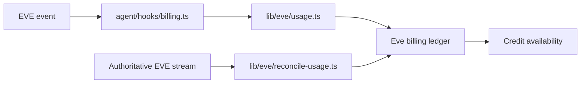

ChatJS records EVE usage as durable billing evidence. The EVE billing hook receives native events, records provider model costs and platform-tool costs with stable event identifiers, and can later reconcile from the authoritative EVE stream.

## Flow

`lib/eve/usage.ts` records model calls, completed steps, compaction usage, and supported platform-tool results. Each record uses an event-derived identity, so replaying an event does not charge it twice.

`lib/eve/reconcile-usage.ts` reads only the unprocessed suffix of the native stream and advances a durable cursor after successful reconciliation. If a completed provider cost cannot be resolved, admission stops until the evidence is reconciled.

`lib/db/credits.ts` owns credit storage and availability checks, including `canSpend`. The usage ledger is evidence for those decisions. A positive balance gate does not reserve a concurrent budget for work that has already started.

## Related

- [Native EVE Conversations](/cookbook/next-chat-transition) for runtime ownership
- [Configuration](/core/configuration) for feature and model choices
