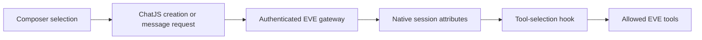

The composer can let a user request one supported tool before they send a message. ChatJS validates the selected tool at admission and passes it to EVE as authenticated turn metadata. The EVE tool-selection hook then narrows the available tool set for that turn.

## Flow

`lib/eve/message-tool-selection.ts` stores the selected UI tool in message metadata for recovery and copy operations. `lib/eve/selected-tools.ts` expands a grouped selection into its allowed native tools. `agent/hooks/tool-selection.ts` reads the authenticated selection at turn start.

Do not trust a browser-supplied tool name by itself. Guest and registered requests both validate the choice against the configured frontend tool set before EVE receives it.

## Related

- [Tools](/tools/overview) for installing and configuring tools
- [Native EVE Conversations](/cookbook/next-chat-transition) for the request boundary
