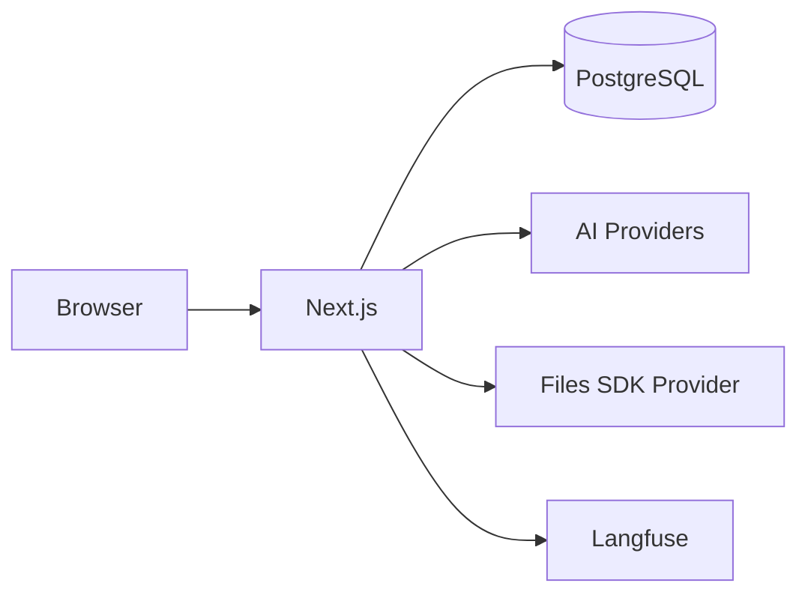
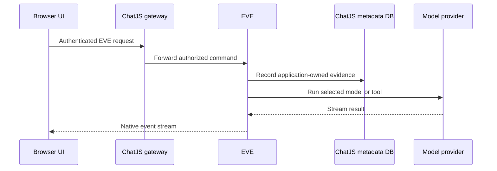

## System Overview

The current ChatJS application uses:

- **Next.js App Router** for the frontend and API routes
- **EVE** for the durable conversation transcript, execution state, approvals, checkpoints, and stream recovery
- **PostgreSQL** (via [Drizzle ORM](https://orm.drizzle.team)) for application-owned metadata such as users, ownership, projects, sharing, files, documents, and billing evidence
- **AI SDK** to connect to multiple AI providers through a [gateway abstraction](/gateways/overview)
- **Files SDK** through a configured [file storage provider](../storage) for attachments and generated media
- **tRPC** for end-to-end type-safe API routes between client and server
- **Langfuse** (optional) for LLM observability, tracing, and analytics

## EVE conversation flow

When a user sends a message:

EVE is the transcript authority. ChatJS records only the metadata and resources it owns around that transcript. Public sharing uses a controlled projection instead of exposing native session access.

## Standalone thread package reference

`@chat-js/thread` remains a separate package for applications that want an AI SDK-compatible `useThread` interface. The following reference describes that package, not the EVE-only ChatJS application runtime.

`useThread` manages a selected conversation path, message tree, and independent response runs. See [useThread](../threads).

## Configuration

All settings flow from a single source:

1. `chat.config.ts` - Your configuration
2. `lib/config/` - Parse and apply defaults
3. `lib/env.ts` - Validate environment variables
4. Runtime - Features enabled/disabled

This ensures type-safe configuration and build-time validation of environment variables. See [Configuration](/core/configuration) for the full reference.
