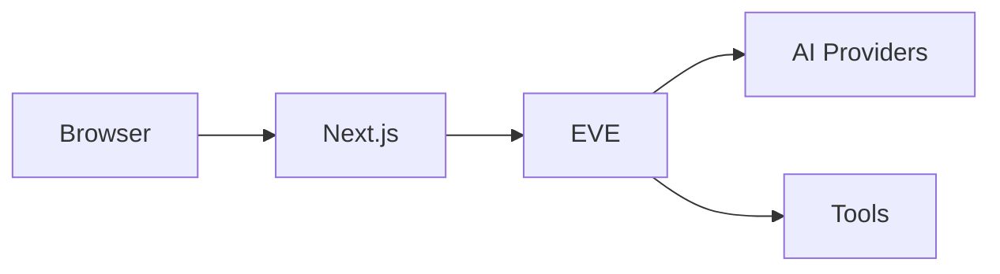
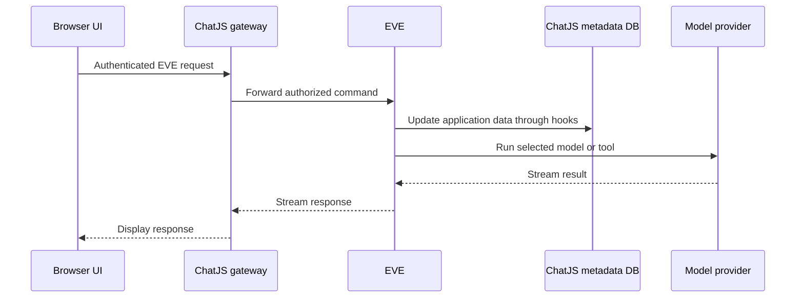

## System Overview

The current ChatJS application uses:

- **Next.js App Router** for the frontend and API routes
- **EVE** for conversation execution, message persistence, tool calls, and stream recovery
- **PostgreSQL** (via [Drizzle ORM](https://orm.drizzle.team)) for application-owned metadata such as users, ownership, projects, sharing, files, documents, and billing evidence
- **AI SDK** to connect to multiple AI providers through a [gateway abstraction](../gateways/overview)
- **Files SDK** through a configured [file storage provider](../storage) for attachments and generated media
- **tRPC** for end-to-end type-safe API routes between client and server

## EVE conversation flow

When a user sends a message:

EVE runs conversations and persists their messages and execution state. ChatJS manages authentication, chat organization, sharing, files, documents, and billing.

## Configuration

All settings flow from a single source:

1. `chat.config.ts` - Your configuration
2. `lib/config.ts` - Parse and apply defaults
3. `lib/env.ts` - Validate environment variables
4. Runtime - Features enabled/disabled

This ensures type-safe configuration and build-time validation of environment variables. See [Configuration](./configuration) for the full reference.
