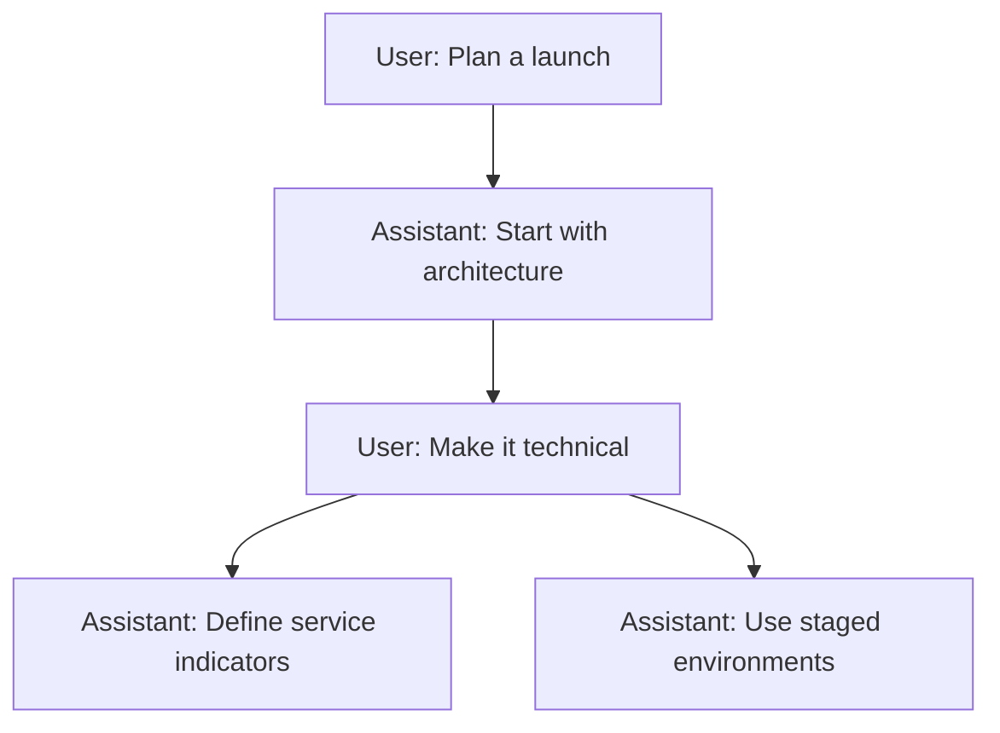

Branching lets you explore another direction without replacing the original conversation path. Editing a message or generating another response creates a sibling that you can return to later.

<Frame>
  
</Frame>

## How it works

Every message has a parent, which forms a conversation tree. ChatJS displays one root-to-message path at a time while keeping the other branches available.

Sending a follow-up continues the selected branch. Edit an earlier user message or regenerate a response to explore an alternative path.

## Navigate branches

When a message has siblings, arrow controls show the current position, such as `2/3`. Use the arrows to move to the previous or next branch.

Switching branches:

- changes the active conversation path
- preserves responses that are still streaming on other branches
- clears transient data that belongs to the previous path
- closes an open artifact when its message is not in the selected path
- follows the selected branch to its latest descendant

## Edit a message

Editing creates a replacement branch. The original message and all of its descendants remain in the tree, so you can switch back with the same sibling controls.

## Runtime

EVE persists conversation messages and executes each branch. ChatJS keeps the branches together in one chat and displays the selected path.

## Related

- [Parallel Responses](./parallel-responses)
- [Architecture](../core/architecture)
