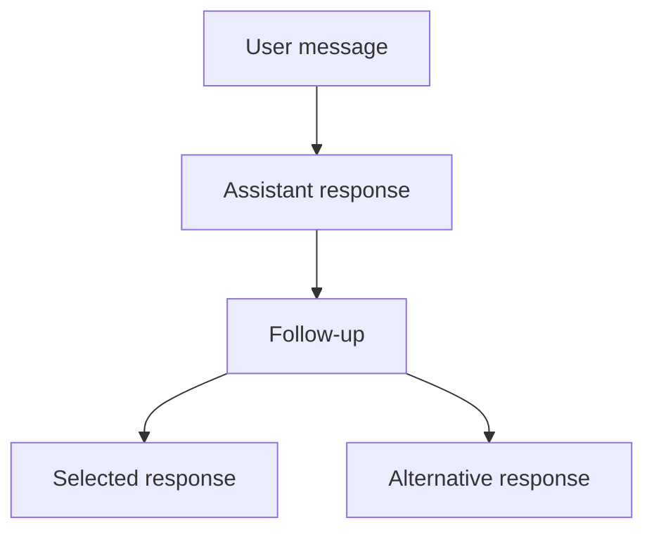

`@chat-js/thread` is a standalone package for branching AI conversations.
Use it in your existing app without installing the ChatJS starter.

The React hook, `useThread`, keeps the familiar AI SDK `useChat` interface for
the selected conversation and stores every branch in a complete message tree.
The `Thread` controller provides the same tree and run controls outside React.

Use it when you need to edit earlier messages, compare alternative replies, or
move between branches while responses continue streaming.

[Try the interactive demo](https://www.chatjs.dev/threads).

## Install

```bash
bun add @chat-js/thread
```

The package manages its AI SDK dependencies and uses your app's existing React
instance (React 18 or newer).

## Use with React

You need a React app and an AI SDK chat endpoint at `/api/chat`.
`useThread()` uses that endpoint by default, just like `useChat()`.
Pass a `transport` option when you need a custom endpoint or request configuration.

Replace the `useChat` import without changing your existing message list or
composer:

```diff
- import { useChat } from "@ai-sdk/react";
+ import { useThread } from "@chat-js/thread/react";

- const chat = useChat();
+ const chat = useThread();
```

The top-level helpers remain compatible with `UseChatHelpers`, including
`messages`, `sendMessage`, `regenerate`, `stop`, `status`, tools, and approvals.

## Mental model

`useThread` separates four concepts:

- **Tree:** every message and its parent-child relationship
- **Cursor:** the message currently selected by the application
- **Active path:** the root-to-cursor messages exposed as `chat.messages`
- **Run:** one assistant response with its own status, error, and stop control



Moving the cursor changes the active path. It does not delete descendants or
stop runs on other branches.

## Create a branch

Select any message and send normally. The new user message becomes a child of
the selected node.

```ts
chat.tree.setCursor(messageId);
await chat.sendMessage({ text: "Explore another approach" });
```

Editing is an application-level operation. Select the original user message's
parent, then send the replacement as a new message:

```ts
chat.tree.setCursorToParentOf(originalMessageId);
await chat.sendMessage({
  id: crypto.randomUUID(),
  role: "user",
  parts: [{ type: "text", text: editedText }],
});
```

See [Branching](./features/branching) for the ChatJS user experience.

## Run parallel responses

Each assistant response is an independent run. Start the first response with a
new user message, then start alternatives from that same user node:

```ts
const userMessageId = crypto.randomUUID();
const primary = await chat.tree.startRun({
  message: {
    id: userMessageId,
    role: "user",
    parts: [{ type: "text", text: "Give me three options" }],
  },
  follow: true,
});

const alternatives = await Promise.all([
  chat.tree.startRun({ from: userMessageId, follow: false }),
  chat.tree.startRun({ from: userMessageId, follow: false }),
]);

await Promise.all([
  primary.finished,
  ...alternatives.map((run) => run.finished),
]);
```

`follow: false` leaves the cursor unchanged. The sibling appears when the first
stream write arrives. ChatJS uses this model for multiple replies from the same
model and for comparisons across different models.

See [Parallel Responses](./features/parallel-responses) for the product flow.

## Status and controls

Top-level state describes the selected path:

```ts
chat.status;
chat.error;
await chat.stop();
```

Tree state describes all runs:

```ts
chat.tree.status;
chat.tree.activeRuns;
chat.tree.runs;

await chat.tree.stopRun(runId);
await chat.tree.stopAll();
```

Statuses use the AI SDK values `submitted`, `streaming`, `ready`, and `error`.

## Persist the tree

Save the complete tree instead of only the selected `chat.messages` path:

```ts
const snapshot = chat.tree.getSnapshot();
await saveThread(snapshot);
```

Restore it with `initialTree`:

```ts
import { DefaultChatTransport } from "ai";

const chat = useThread({
  initialTree: savedSnapshot,
  transport: new DefaultChatTransport({ api: "/api/chat" }),
});
```

The snapshot is `{ version: 1, cursorId, nodes }`. Runtime indexes, active
requests, and run adapters are not persisted.

## Use without React

Import the controller from the core entry point:

```ts
import { Thread } from "@chat-js/thread";
import { DefaultChatTransport } from "ai";

const thread = new Thread({
  transport: new DefaultChatTransport({ api: "/api/chat" }),
});

await thread.sendMessage({ text: "Plan a weekend in Lisbon" });
const snapshot = thread.getSnapshot();
```

Use `subscribe()` to observe state changes and `stopAll()` to cancel active
requests when your application no longer needs the controller.

## Package reference

The [package README](https://github.com/FranciscoMoretti/chat-js/tree/main/packages/thread)
covers the full interface, transport metadata, and custom state adapters.
