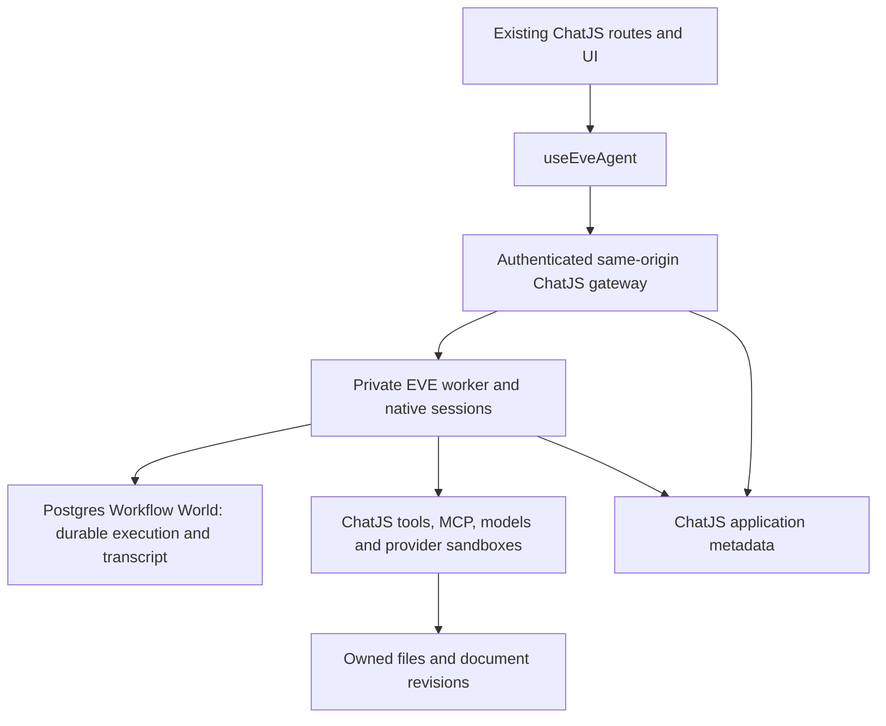

# ChatJS → EVE migration report

Report date: 13 September 2026. Implementation reviewed at `d9cb2c84` on `codex/eve-app-runtime`. This report accompanies consolidated draft [PR #444](https://github.com/FranciscoMoretti/chat-js/pull/444). GitHub reports merge conflicts with current `main`; this is not a merge-ready branch.

## Status and scope

The migration is implemented and exercised locally inside the existing ChatJS application. EVE owns conversation execution and the durable transcript; the normal ChatJS routes, composer, sidebar and artifact UI integrate with it. This is **ready for code review, not production cutover**. The reporting audit found a concrete generated-app release blocker: the patched Postgres Workflow World is not vendored alongside EVE and MCP. This narrows the earlier local completion statement: the worktree is validated, but generated-app runtime equivalence is not complete.

At report time, the branch has 199 commits not in current `origin/main`, and current `main` has 87 commits not in this branch. The migration diff against the merge base is 589 files, +132,571 / −1,302 lines, before this report. Approximately 65,283 added lines are Drizzle snapshots, 29,877 are tests/fixtures, 13,037 are patches and their documentation, and 24,374 are other source/configuration/docs. These figures describe review size, not product complexity or test coverage. The last integration with main was earlier in the work; current-main integration and its regression checks remain outstanding.

The runtime gate explicitly requires `NODE_ENV === "development"` and `EVE_ENABLED === "true"`. Merely setting the flag in production does not activate EVE. The Next.js wrapper also only enables EVE for the development-server phase. No production database cutover, merge, release, or upstream issue publication is included. The consolidated PR can be split into a review stack later.

Historical ChatJS conversations are intentionally not imported or displayed in EVE mode. Their data remains untouched. Saving a copy of an **EVE public share** is implemented and is separate from importing legacy ChatJS conversations.

## Architecture and data ownership

- **EVE:** messages, execution, approvals, turn identity, restored history, checkpoints and workflow state. The browser uses EVE's native reducer/stream.
- **ChatJS:** authentication, session ownership, operation admission/recovery, titles/pins/projects/sharing/votes, quota and billing ledgers, file ownership, document revisions, deletion inventories and receipts.
- **Providers:** model calls, object storage and sandbox resources. Their lifetime requires explicit accounting and cleanup beyond deleting a conversation row.

There is no ongoing synchronization of two independently authoritative chat transcripts. Creation intents, copy preparation and checkpoint references do persist recovery material; documents also retain their own revision history. Those are deliberate domain records, not a second live conversation engine. Public sharing uses an allowlisted projection of native content rather than exposing the native session API to anonymous readers.

Key entry points: [runtime gate](../apps/chat/lib/eve/availability.ts), [agent](../apps/chat/agent/agent.ts), [gateway](../apps/chat/app/api/eve/[...path]/route.ts), [conversation UI](../apps/chat/components/eve/eve-conversation.tsx), and [application procedures](../apps/chat/trpc/routers/eve.router.ts).

## What migrated

| Area | Implemented behavior | Important boundary |
| --- | --- | --- |
| App integration | `/`, `/chat/[id]`, project chats, sidebar, composer and artifacts use EVE in development; `/agent` redirects into the normal app | Legacy runtime remains for EVE-disabled operation |
| Sending and recovery | Immediate composer clearing on accepted send; retained intent for uncertain delivery; reload/retry with stable operation identity; explicit rejection restores editable input | A lost response is not treated as proof that creation failed |
| Streaming and lifecycle | Durable reload/resume, checkpoints, native pending input, approval continuation and cancellation | Worker/provider availability is still required; local supervision is not hosted availability |
| Models | Existing model picker, validated per-turn model selection, durable response provenance, regeneration with original model | The available catalog and credentials still govern usable models |
| Comparisons | Multiple native candidate sessions, initial and follow-up comparisons, candidate selection, retained drafts and recoverable admission | Separate native executions incur separate usage |
| Attachments | Owned uploads, image/PDF input, durable references, previews after reload, multipart recovery, inherited files during editing/copying | Validation is for supported file/model paths, not every advertised provider or MIME type |
| Edit/regenerate/forks | Checkpoints at turn boundaries, fresh branch execution, history restoration, version navigation, ancestor-aware edits and original response models | This uses substantial maintained EVE checkpoint/fork support with bounds below |
| History and metadata | EVE-only paginated/searchable history, rename, pin, ownership isolation | Legacy history stays hidden |
| Projects | Create/rename/remove, instructions, project-scoped conversations, moving chats, removal detaches surviving chats | Registered-user organization; guests do not gain registered project access |
| Sharing | Public read-only projection, private/foreign access rejection, revocation, safe tool/file/document exposure | Public access is not access to native execution or private metadata |
| Save a copy | Durable copy preparation, no generation just to copy, retry after lost reply/source revocation, independent attachments/documents and later continuation/edit/regenerate | This is a sanitized conversation copy, not cloning provider credentials or live execution |
| Feedback | Owner-only assistant votes, reload persistence, error recovery, shared UI states | Private voting metadata excluded from public shares |
| Tools | ChatJS installed/custom tools and shared validated renderers; native optional defaults disabled; selected-tool policy retained per turn | Only configured tools are exposed; generic unreviewed EVE defaults do not bypass ChatJS policy |
| Search and research | Search progress/sources; native research pipeline, clarifications, durable reports and usage | Depends on configured search/model providers |
| Code and charts | Native sandbox execution, real output, Python chart rendering, document Run, fixed tool-charge reconciliation | Provider sandbox identity and cleanup must be provable |
| Documents/artifacts | Native tool creation, revision history, autosave/recovery, manual edits, comparisons, copy actions, assistant actions, auto-open, share and fork isolation | App document state is checkpointed alongside native conversation boundaries |
| Images | Native generation/editing, durable generated files, reload and shared results | Actual image provider has its own pricing and availability |
| Video | Adapter, schemas and renderer support are present | Disabled by existing product defaults; no claim of live paid-video end-to-end validation |
| MCP | Authenticated discovery/execution, schema validation, connector controls, result rendering, OAuth callback/refresh/reconnect, native execution receipts | Arbitrary server/provider interoperability and resumed approval-policy scenarios are not exhaustively tested |
| Guest use | Stateless bootstrap, isolated history, configured model/tool policy, atomic quota admission, follow-ups/comparisons and retry-safe reservations | No registered-user credit row is created; guest policy may expose fewer tools |
| Billing | Event-idempotent usage, primary/auxiliary/compaction costs, provider reconciliation and durable cursors, separate guest accounting | Positive-credit admission is not a hard concurrent-spend reservation |
| Deletion | Owner-visible pending/deleted state, immediate access fence, family-wide inventory, retryable native retirement, files/documents/sandboxes/queue payload cleanup and durable tombstones | Complete erasure is implemented for the explicitly supported local provider configuration, not arbitrary hosted worlds |
| Expiry and orphan cleanup | Guest-family expiry, bounded fair retries, retained billing identity, orphan upload ownership/fences | Automatic scheduler is development/loopback-only |
| Developer operation | Single app/EVE startup, bounded health checks, macOS supervision, restart backoff and heap limits | Laptop sleep, database failure and remote provider outages remain real availability limits |
| Generated apps | Patched runtime vendoring, helper inclusion and validation during scaffold/template generation; shared registry tool schemas/renderers | EVE/MCP are vendored, but the patched Postgres world is missing: release blocker |

## Complications encountered and resolutions

1. **Backend-only integration would have created competing state owners.** The chosen implementation uses `useEveAgent` through the existing ChatJS UI. App metadata is indexed separately, while native conversation state remains EVE's.
2. **Sending could look stuck or lose visible intent on reload.** Composer state and durable creation identity now distinguish acceptance, explicit rejection and unknown delivery. Recovery reuses the operation; guests replay admitted requests before volatile quota/model/file preflight can invalidate them.
3. **Fork/edit behavior needed more than replaying visible messages.** Native checkpoints carry model history and compatible resource snapshots; display history is restored without replaying execution or charging copied turns. Named idle checkpoints enable later comparisons/copies without a dummy turn.
4. **Approval continuation lacked a valid turn identity.** A maintained EVE guard opens the required turn for continuation, preserving usage attribution.
5. **Pending work could block cancellation in Postgres workflows.** The world patch removes serialization between distinct deliveries while retaining exact delivery deduplication.
6. **Deletion spans much more than app rows.** Native sessions, child/collector runs, streams, queued work, documents, shared file references and provider resources require fences and retry receipts. Unknown resource ownership or uncertain allocation leaves deletion pending rather than reporting erasure.
7. **Repeated billing reads consumed excessive database transfer.** Reconciliation now tracks durable cursors and skips unchanged streams; the Postgres reader patch resumes after the consumed boundary. After the Neon quota warning, verification moved to isolated local Postgres. This report performs no Neon reads. It does not claim a measured production bandwidth budget.
8. **Generated apps must receive the exact maintained runtime.** Bun patch/cache behavior required relocated helper files, installed-byte verification and vendored tarballs, rather than assuming a successful install proved the patch. The reporting audit found that this is incomplete for the Postgres world package; see the confirmed generated-app blocker below.
9. **MCP OAuth refreshes raced.** Connector-scoped serialization and token reuse protect rotation across fresh clients. A separate SDK SSE patch coalesces refresh and handles late 401 responses. Tokens/credentials are not persisted inside workflow closures or copied into public transcripts.
10. **Browser tests exposed fixture drift.** Old model aliases, changed recovery text, an unintended model-selected approval tool, too-short deletion cleanup, and an obsolete one-row billing assumption were corrected in the latest parity tests. The extra billing row was an independently recorded follow-up suggestion call. These were not all product failures, and failures were not simply rerun until green without examining them.

## Maintained patches and technical debt

| Debt/workaround | Why it exists | Exit condition / risk |
| --- | --- | --- |
| `eve@0.52.2` compiled dependency and readable source patches | Approval continuation, native checkpoints/forks/restored history, idle seeds, approval receipts, resource/birth/inventory support | Upstream or a published maintained fork must replace them with equivalent contracts and migration tests. Browser and worker must use matching patched wire versions |
| `@workflow/world-postgres@5.0.0-beta.40` patch | Cancellation delivery and efficient resumed-stream reads | Re-evaluate on upstream upgrade; concurrency/deduplication and transfer regressions need explicit tests |
| `@ai-sdk/mcp@2.0.45` patch | Single-flight SSE auth recovery and late-401 handling | Replace after upstream equivalent lands; test rotating credentials across fresh and established clients |
| Missing world patch in generated apps **(known defect)** | Root installs a patched world; scaffold and template sync vendor only EVE/MCP, leaving the registry world dependency | Vendor/verify the patched world too, or exclude EVE from generated apps until an equivalent upstream release; cancellation and efficient stream reads otherwise differ from this worktree |
| Direct Postgres stream-position reads | Efficient billing reconciliation currently uses pinned World schema/stream naming | Replace with a supported authorized batch-position API; schema upgrades need adapter/regression review |
| Local SQL resource fences/inventories/retirement | Safe erasure is not a single upstream delete call | Hosted/provider-portable deletion needs separate design and certification; setup is an explicit local migration |
| Checkpoint snapshots and copy journals | Restore history/resources without a second execution authority | Full snapshots can grow quadratically; retention/compaction/garbage-collection policy needs production-scale work |
| Patch helper relocation and vendored tarballs | Bun nested patch-file creation/cache behavior and cross-package-manager distribution | Remove only when supported tooling installs equivalent files reliably; repeat clean-cache installation checks on upgrades |
| Legacy runtime retained behind gate | Production has not cut over | Remove after cutover and rollback policy are settled; shared component regressions remain possible in either mode |
| Acceptance suite/model drift | Work progressed in many validated slices; some older tests still reference GPT-4.1 aliases | Normalize obsolete fixtures and maintain a runnable low-cost acceptance manifest; a historical pass does not guarantee an old script runs unchanged today |
| Documentation drift | Some upstream drafts and patch notes were written before later implementation | Reconcile stale “remaining work” sections before using them as release notes; e.g. comparisons/OAuth now have later passing evidence |
| Local-only observability/supervision | Development reliability was needed immediately | Hosted worker supervision, metrics, alerting, incident response and SLOs remain deployment work |

The MCP SDK patch coordinates one transport; the application database lock also coordinates independent clients. An upstream per-transport fix alone is not a reason to remove the cross-client credential-rotation protection.

Patch implementation and rebuild details live in [patches/README.md](../patches/README.md). Its older remaining-work statements must be read against this dated report and current code; it is not an authoritative completion checklist. In particular, its “Remaining integration” and named-checkpoint sections still describe comparison/composer work as pending, and the public-copy draft contains both earlier missing-journal notes and later completed-integration notes.

Explicit limits include a 1,000-record fork-checkpoint scan cap, bounded 8 MiB / 50,000-event history restoration, a bounded transcript-copy size, and local filesystem snapshot limits of 20,000 entries / 128 MiB. Unsupported resources, symlinks/special files or missing birth evidence can make a fork/deletion fail closed. Historical sessions created before required checkpoint/identity support cannot be assumed compatible. Microsandbox snapshot capture can interrupt source processes; provider-wide snapshot retention and atomic capture of concurrent background writes are not established.

Billing rounds to cents per turn, preserves known zero costs and records auxiliary model calls separately. Unknown completed costs block new admission pending reconciliation. Already running work can overspend the positive-credit gate. Approval/cancellation remains available at zero credits. This is intentional behavior, not a hard financial budget guarantee.

## Verification evidence

Evidence below combines the latest parity batch and earlier successful checks on the migrated paths. **It is not one clean all-features run on the final commit.** Raw local logs may contain request details and are not uploaded. Filenames below are provenance on the development machine under `/private/tmp` (also `/tmp`), not portable CI artifacts. Test source lives in `apps/chat/tests/`; unit tests are co-located with implementation. A recorded pass only supports the named scenario.

### Latest parity batch

| Verified scenario | Evidence | Result |
| --- | --- | --- |
| History paging/search and owner isolation; rename/pin persistence | `eve-parity-sidebar-browser.log` | 2 passed |
| Real Gemini response, public read-only sharing, private/foreign denial and revocation | `eve-parity-sharing-browser.log` | 1 passed |
| Project UI/instructions, deliberate error recovery, native response, reload and project deletion preserving chat | Project test in `eve-parity-versions-browser.log` | 1 passed; other tests in this initial batch failed and were subsequently corrected |
| Two native Gemini responses, switching, retained unsent draft and reload | Comparison test in `eve-parity-versions-final.log` | Passed |
| Edit lost-reply recovery, regeneration/model provenance, version navigation, retained/rejected draft | Editing test in `eve-parity-versions-final.log` | Passed; that batch also contained a fork failure |
| Sidebar deletion, durable tombstone and native retirement | Deletion test in `eve-parity-forks-deletion.log` | Passed; fork billing assertion failed in that batch |
| Fork history, source independence, replay/conflict, foreign/raw-source rejection, branch-only billing and family cleanup | `eve-parity-forks-final.log` | 1 passed |
| Repository lint and type checks | `eve-parity-batch-lint.log`, `eve-parity-batch-types.log` | Passed |
| Workspace unit suite | `eve-parity-unit.log` | Passed (7 task groups); run before the final test-only assertion updates |
| ChatJS, EVE and database readiness | `eve-parity-final-health.log` | Healthy after final commit |

### Earlier native/integration acceptance

| Area and exercised contract | Evidence | Qualification |
| --- | --- | --- |
| Actual model picker reaches native execution and persists selected model; OAuth callback, encrypted persistence, token refresh and native MCP execution/reload | `eve-sse-final-browser.log` (2 passed) | Real app/EVE/model; OAuth server is a controlled fixture, not every real connector |
| Durable image uploads; multipart send recovery and composer clearing | `eve-file-reference-final-browser.log` (2 passed) | Real native attachment paths; supersedes some failed intermediate runs |
| Code execution, real output and one-time fixed charge | `eve-code-browser-credentials.log` (1 passed) | Credentialed sandbox/provider path |
| Python interactive chart and reload | `eve-code-python-final.log` (1 passed) | Real execution/rendering |
| Document Run, document states, native document creation/revisions/reload/share | `eve-document-run-final.log` (4 passed) | Mixed native and UI-state scenarios; do not count all four as independent provider executions |
| Image generation/editing/stored results/sharing | `eve-native-image-browser-cold.log` (4 passed, includes `eve-image.e2e.ts`) | Native image acceptance plus related scenarios |
| Native deep research, durable report/reload and usage receipt | `eve-live-research24.log` (1 passed) | Native research path; separate renderer tests do not substitute for this |
| Guest admitted creation after lost browser reply, exactly-once native turn and quota | `eve-guest-recovery-browser.log` (1 passed) | Guest auth and native execution, isolated DB |
| Automatic expired guest cleanup and retained billing identity | `eve-scheduler-browser.log` (1 passed) | Local startup scheduler, not production scheduling |
| Internal retirement settles usage after access revocation and retries | `eve-retire-browser-final.log` (1 passed) | Local provider contract |
| Deleting/deleted conversations reject browser access and old creation requests | `eve-deletion-fence-browser-fresh.log` (2 passed) | Access/operation fences, not hosted-provider erasure |

### Additional recorded acceptance

| Scenario | Log evidence | Result / level |
| --- | --- | --- |
| PDF reaches model and opens after reload | `eve-pdf-full-chromium2.log` | 1 passed; native/browser |
| Save a public copy, recover and continue | `eve-copy-ui-browser.log` | 1 passed; native/browser |
| Copied attachments, PDF and imported image edits | `eve-copy-attachment-live.log`, `eve-copy-pdf-live.log`, `eve-copy-png-edit-browser.log`, `eve-copy-image-final.log` | 1 passed each; native/browser, later successes coexist with older failed runs |
| Independent copied documents and native continuation/editing | `eve-copy-documents-live.log` | 1 passed; native/browser |
| Regenerating copied responses with original model provenance | `eve-model-browser.log` | 1 passed; `eve-copy-regeneration-live.e2e.ts` |
| Private votes, reload/error recovery and feedback UI states | `eve-feedback-final-browser.log` | 2 passed; persistence/browser and UI fixtures |
| Follow-up suggestions, normal submission and retained unsent content | `eve-followups-browser.log` | 2 passed; native and UI tests |
| Moving conversations between projects with error recovery | `eve-project-move-verified-browser.log` | 1 passed; browser/local DB |
| Search execution/results | `eve-search-browser.log` | 1 passed; `eve-search.e2e.ts` |
| Guest comparison and guest lifecycle | `eve-guest-comparison-browser.log`, `eve-guest-lifecycle-browser.log` | 1 passed each; native/browser/local DB |
| Registered creation lost-response recovery | `eve-create-recovery-browser-final.log` | 1 passed; browser/native |
| Cancellation and related recovery/retirement/MCP scenarios | `eve-cancel-final-browser.log` | 5 passed; mixed lifecycle batch |
| Tool selection | `eve-tool-selection-browser.log` | 1 passed; selected-tool integration |
| Template/package installation smoke checks | `eve-template-fallback-tests.log`, `eve-bunpacked-tests.log` | 14 pass each; packaging smoke, not proof of patched-world inclusion |

These records are historical scenario evidence, not a claim that every older script runs unchanged against today's catalog. Tests and assertions should be reviewed alongside the log when deciding what to repeat after main integration.

Unit and isolated database contracts additionally exercise authorization, immutable operation hashes, admission races, quota release fencing, cost replay, usage cursors, file reference ownership, document revisions/checkpoints, copy reservations, provider scope/birth evidence, queue inventories and late-write fences, cleanup retries, tool schemas, approval receipt identity and SDK refresh concurrency. Some native harness tests use deterministic models and no provider.

Selected UI tests include desktop/mobile captures, error/pending/empty states and artifact renderers. They do not establish a hosted visual baseline, complete mobile coverage, accessibility compliance or cross-browser compatibility.

## Where gaps could remain

1. **Generated-app runtime mismatch (confirmed blocker).** `scripts/sync-template.ts` and `packages/cli/src/helpers/scaffold.ts` vendor EVE and MCP, while the app manifest retains the registry Postgres world. The root patch registration does not travel with that generated dependency. Add world vendoring and fresh-install/archive assertions before an EVE scaffold release. Existing packaging passes cover EVE/MCP, not all three.
2. **Integration with latest main.** The 87 missing commits need merge/rebase, conflict review and regression testing. This draft does not certify the merge result or current-main feature parity. Splitting the 199-commit migration will make review safer and expose accidental coupling.
3. **Hosted deployment and production data.** The development gate remains in place. Hosted worker topology, migrations, auth callbacks, secrets, database pools, rollback, provider setup and deletion support need deployment-specific rehearsal. Local Postgres success is not evidence of Neon production behavior.
4. **CI/runtime mismatch.** Existing Playwright workflow still selects Node 22, while EVE requires Node 24+. No dedicated hosted EVE acceptance pipeline was established by the local runs. A green legacy pipeline alone cannot certify this migration; fresh PR CI results must be reviewed separately.
5. **Coverage provenance and fixture drift.** Evidence spans different commits, providers and controlled fixtures. Some old test model IDs and draft notes are stale. Maintain a reproducible acceptance manifest and run the chosen suite after main integration; do not advertise a numerical “100% coverage” claim.
6. **Scale and storage.** Large/long conversations, many concurrent sessions, checkpoint growth, comparison fan-out, database transfer, queue backpressure and long-duration recovery have not been load/soak-certified. Existing bounds reject unsupported work but do not prove acceptable production capacity.
7. **Provider uncertainty.** Lost sandbox-create replies, changed credential scope, unavailable cleanup APIs and incomplete birth evidence can leave deletion pending. A provider 404 or timeout is not automatically proof of non-allocation. This is documented behavior requiring operational handling.
8. **Backend portability.** Snapshot/deletion evidence is scoped to implemented local providers. Other EVE worlds/sandbox backends, hosted erasure guarantees, snapshot retention and recovery across mixed runtime versions need work.
9. **MCP and approvals.** OAuth refresh is exercised end to end with a fixture; native approval receipt invariants have harness tests. This does not certify arbitrary remote servers, all conditional-policy changes or every compiled restart/resume path. The pinned SDK does not provide a universal server-driven approval policy contract.
10. **User experience breadth.** Chromium and selected responsive states are exercised. Safari/Firefox, full keyboard/screen-reader audits, Electron packaging/runtime behavior, every model/file/tool combination and a hosted visual-baseline run are not claimed.
11. **Explicitly deferred scope.** Historical ChatJS conversation import remains deferred by product decision. Video remains disabled and has no live paid-provider end-to-end acceptance claim. PR splitting, production cutover and release approval remain separate steps.

## Upstream reports and review order

Unpublished drafts are in [docs/upstream-drafts](upstream-drafts): batch stream positions, compaction usage, checkpoint readiness, MCP approval policy, pending cancellation, public conversation copy, session deletion, Sandbox allocation reconciliation and Postgres stream transfer. The SDK SSE refresh draft is in [patches/ai-sdk-mcp-sse-refresh.issue.md](../patches/ai-sdk-mcp-sse-refresh.issue.md). Publishing this ChatJS PR does not publish those issues to upstream repositories. Some drafts need updating against later fixes before approval to send them.

Recommended review sequence:

1. Architecture boundaries, production gate and intended product differences.
2. Maintained EVE/world/SDK patches and their reproducible packaging.
3. Auth/admission/guest quotas/billing and the deletion/resource-fence protocol.
4. Native UI, branches/comparisons/copies, files/documents and tool adapters.
5. Main integration, CI/Node alignment, acceptance manifest and staged deployment rehearsal before considering production cutover.
