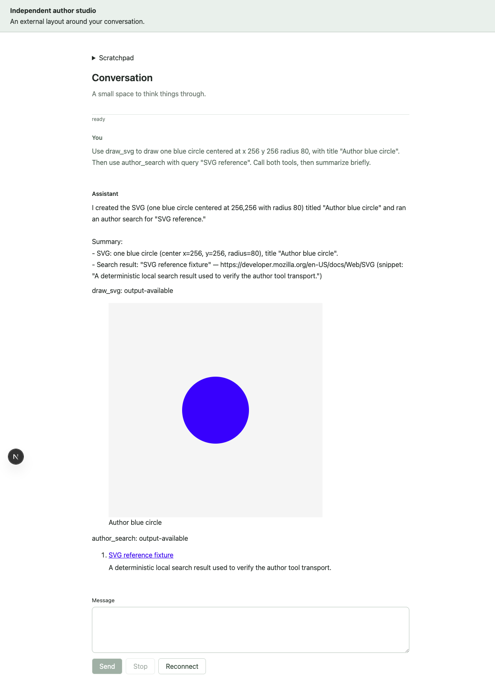

# External registry author examples

An external developer supplies an implementation for a selectable ChatJS boundary
using an ordinary shadcn registry item. The implementation follows that boundary's
native contract: a model factory, an Eve tool, a validated result renderer, or a
React layout/component. There is no shared runtime extension interface.

This is a provisional proof against [PR #318](https://github.com/FranciscoMoretti/chat-js/pull/318)
commit `1b47cffe692acb8e2ebaf1ebebfa7ec76df75f10`. The installer and minimal starter
are unchanged. Adoption into the accepted product/docs remains pending review of
#318. No registry is published by this example, and no P2 service is required.

## Run the disposable installer proof

From this branch's repository root, with Bun and Node 24 on PATH:

```sh
bun install --frozen-lockfile
bun examples/external-author/proof.ts
```

The script builds and invokes the real CLI executable, starts an author-owned
loopback HTTP registry, and creates fresh apps under `.local-research/`. It prints
the output directory on success. Set `AUTHOR_OUTPUT` to choose a fresh destination.
It downloads selected package dependencies; it needs no provider credential or
running database. It checks the installer/starter against the recorded pin before
running. Keep this branch's base when reproducing the snapshot.

| Generated app | External choices | Observed Eve tools |
| --- | --- | --- |
| `studio` | Model factory, drawing tool/renderer, search tool/renderer, layout, scratchpad | `draw_svg`, `author_search` |
| `frontend` | Layout and scratchpad | None before the add test |
| `search` | Search tool/renderer | `author_search` |

The proof also adds the drawing item to the frontend app. It verifies that a
customized client is preserved, reviews the generated proposal programmatically,
adopts that proposal in the disposable app, and typechecks it. Finally it creates
a deliberately incompatible model fixture and verifies the expected Eve build
failure. Generated receipts and `evidence.json` record the concrete installed
sources and dependencies. The HTTP registry shuts down when the script exits.

## Author the items

[registry.ts](registry.ts) is the complete item mapping and
[proof.ts](proof.ts) contains the shared selections and CLI invocations. Replace an
official provider item with an external URL in `items`; keep the required base,
identity, and execution providers. Two providers of the same exclusive capability
are rejected. Each item declares its own files, explicit `~/` targets, package
dependencies, and the small `meta.chatjs` composition hints used at this pin.

- **Model:** [model-source/gateway.ts](model-source/gateway.ts) exports
  `createModel(modelId)` and returns the native OpenAI Responses model. The
  selection fixes `settings.model` to `gpt-5-mini`. `AUTHOR_GATEWAY_URL` and
  `AUTHOR_GATEWAY_KEY` are runtime server environment variables. The factory is
  supplied by the external item instead of `@chatjs/openai`; it uses the provider's
  native SDK contract. A different Responses endpoint still needs its own live
  compatibility check.
- **Tools and renderers:** [TOOLS.md](TOOLS.md) describes native Eve tools,
  shared Zod output schemas, inferred renderer props, HTTP behavior, and lazy
  result rendering. Search replaces the available tool choice; it does not inject
  a provider into a separate research pipeline.
- **Frontend:** [FRONTEND.md](FRONTEND.md) describes a layout accepting children
  and an independent no-props scratchpad. Neither adds npm dependencies.

The author items install only their selected dependencies. The positive cases do
not install `@ai-sdk/openai-compatible`, Files SDK, sandbox, Tavily, Firecrawl, or
CSV peers. Common application dependencies still come from the selected base.

## Optional live journey

The installer proof is credential-free. A live model request is separate and
requires an authorized `OPENAI_API_KEY`, local PostgreSQL 17 binaries, and Node 24.
Use a fresh generated studio directory; the fixture creates its own database.
The harness defaults to Homebrew binary paths; override `AUTHOR_NODE` and `PG_BIN`
on other machines. It uses this worktree's assigned minimal-app ports.

```sh
AUTHOR_APP="/absolute/path/printed-by-proof/studio" \
  bun examples/external-author/live.ts
```

Keep `OPENAI_API_KEY` in the invoking environment. The harness writes a private
`.env.local`, starts its own database/worker/app and authenticated local search
fixture, and records the app URL in `evidence/live-context.json`. Use the generated
`evidence/identity.cookies` host fixture to authenticate your local browser (its
`chatjs_identity` cookie targets the printed app origin). Do not publish those
private files. Open the app and send:

> Use draw_svg to draw one blue circle centered at x 256 y 256 radius 80, with title
> "Author blue circle". Then use author_search with query "SVG reference". Call
> both tools, then summarize briefly.

Verify the SVG, search link, reload replay, and scratchpad behavior from
[FRONTEND.md](FRONTEND.md). Ctrl-C stops the owned services and database. Remove
the disposable output when finished, including the private environment/cookie.

## Executed evidence and limits

[EVIDENCE.json](EVIDENCE.json) summarizes the run on 2026-09-06. All three generated
apps typechecked and built their Eve tool graphs. Runtime conformance rejected
malformed output and HTTP responses; a compile-only negative rejected incompatible
renderer props. The client bundle excluded server credential/HTTP code and kept
both result renderers out of its entry chunk. Repository lint/types and all 42 CLI
unit tests passed.

The live generated studio used real OpenAI Responses through the external factory.
Both tools ran and rendered; reload replayed the saved results without another
search request. The search endpoint was a deterministic local fixture. Scratchpad
editing/count/clear/reset worked, and Next MCP reported no compilation or session
errors. The screenshot shows the replayed results:



The negative model item passes TypeScript but Eve rejects its unlisted provider
identity because context-window metadata is unavailable. This pin's model
composition metadata has no context-window field. An exploratory attempt to name
the generic compatible adapter `openai` passed Eve build but failed a live request
with `Unknown parameter: safetyIdentifier`; borrowing a native provider identity
is not a supported workaround. The successful example uses the native adapter.
The CLI owner should decide the per-case metadata path before documenting arbitrary
model identities as supported.

Frontend composition currently exposes a children layout and no-props components.
Composer replacement, conversation actions/state, toolbar slots, and lifecycle
callbacks are unsupported here. Renderers handle validated completed outputs;
partial/error/cancellation behavior remains owned by the base UI. Arbitrary
external dependencies at every existing product choice remain the broader goal;
these examples prove only the listed boundaries on this provisional snapshot.
