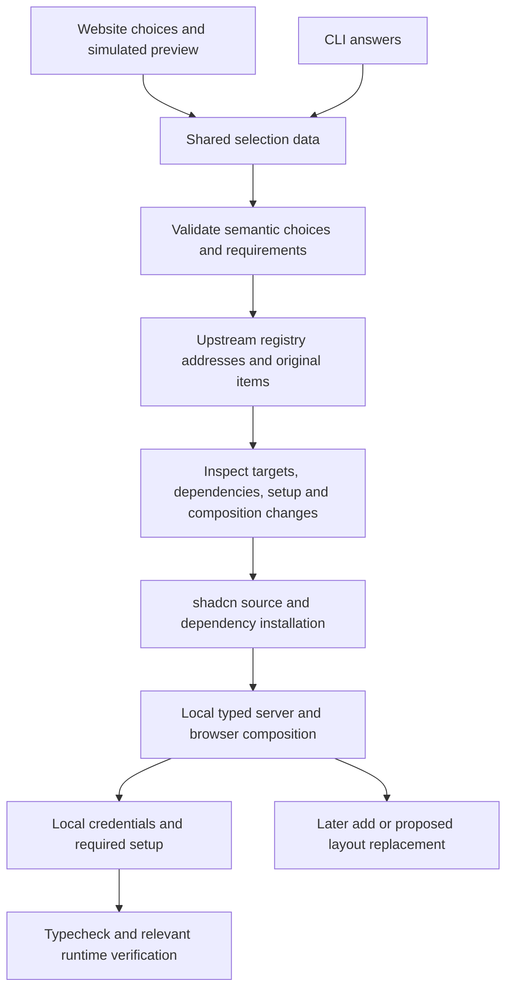

# M08: shared selection, registry and typed composition options

**Decision update:** Francisco accepted the recommendations in this task: shared JSON selection with standard upstream bundles, developer-owned composition and proposed edits, narrow optional semantic metadata, and the staged delivery boundary. The examples below remain illustrative rather than implemented public APIs. His follow-up asks how compatibility can be verified without testing every application permutation; universal interchangeability is not an accepted promise. The [concrete compatibility plan and M07 executable variants](./m08-compatibility-plan.md) now provide the follow-up evidence.

Exploration on 2026-09-06, based on main `18db694b9b67263904707a85f93673f494ea0e6d` (AI SDK 7, PR #308). **Tentative recommendation: a small data-only selection envelope, ordinary upstream registry items, and developer-owned TypeScript composition.** No CLI rewrite, website, publication or supported Eve starter was implemented. The decisions at the end are for discussion with Francisco.

## Inputs and evidence boundaries

Read the coordination [integration findings](/Users/fran/Code/chat-js/research/framework-evolution/implementation/findings-integration.md), work packets and investigation index; reused [R09 installation evidence](/Users/fran/.codex/worktrees/c997/chat-js/research/framework-evolution/implementation/findings/r09.md) at `070cd7f3`, [R04 paired tool evidence](/Users/fran/.codex/worktrees/ceca/chat-js/research/framework-evolution/implementation/findings/r04.md) at `33b2a31d`, and [R07 parity inventory](/Users/fran/.codex/worktrees/b381/chat-js/research/framework-evolution/implementation/findings/r07.md). The [Eve tree prototype](/Users/fran/.codex/worktrees/c631/chat-js/research/framework-evolution/implementation/findings/eve-tree-session-prototype.md) at `8d584dcd` establishes private feasibility. Its history/ACL patch is not a supported upstream contract; distributed create-once is unproven. Main's `ai@7.0.93` and the isolated prototype's `ai@7.0.84` have a tested typed seam, not one validated production dependency graph.

Settled decisions were read directly from [capabilities #287](https://github.com/FranciscoMoretti/chat-js/issues/287), [layout #288](https://github.com/FranciscoMoretti/chat-js/issues/288), [create/add #289](https://github.com/FranciscoMoretti/chat-js/issues/289), [infrastructure #290](https://github.com/FranciscoMoretti/chat-js/issues/290), and [external options #291](https://github.com/FranciscoMoretti/chat-js/issues/291). This report refines mechanics, not those product decisions.

Current primary-source verification and the executed design-preset codec are in [upstream contracts](./m08-upstream-contracts.md). Current observed pins remain `shadcn@4.21.0`, `eve@0.52.1` (vendored shadcn `4.18.0`). The new [spike](./m08-fixture/README.md) actually installs selected source with standalone shadcn, compiles generated TypeScript and checks omissions. It is deliberately a small installation fixture. It does **not** claim a full generated reference app, real Eve execution, or a live tool/model integration.

## What changes from today's implementation

| Current main source | Observed behavior | Proposed boundary |
| --- | --- | --- |
| `packages/cli/src/commands/create.ts` | Prompts produce separate values; scaffold precedes config/tool installation; no shared selection input | Both prompts and website emit the same validated data value |
| `packages/cli/src/helpers/scaffold.ts`, `scaffoldFromTemplate` | Copies the packaged demo or whole `apps/chat` directory | Upstream base scaffold followed by only selected source items |
| `packages/cli/src/registry/schema.ts`, `resolve.ts` | Private tool-shaped schema; one URL template for names | Upstream shadcn item/address/dependency contract |
| `packages/cli/src/utils/install-registry-tools.ts` | Writes source, then deps, then injects tool/browser indexes; partial writes can precede conflicts | Resolve/inspect first; source install plus explicit composition/setup completion |
| `packages/cli/src/commands/add.ts` | Tool-only, requires `chat.config.ts`, knows `paths.tools` | Any compatible installable piece, with placement distinct from installation |
| `packages/cli/src/commands/config.ts` | Executes project TS and prints `applyDefaults` JSON | Keep local inspection separate from serializing/share-exporting a starting selection |
| `apps/chat/lib/config-schema.ts`, `lib/ai/gateways/registry.ts` | Closed gateway map imports all five implementations | Infer from selected local imports; no central implementation union |

These observations use [main CLI source](https://github.com/FranciscoMoretti/chat-js/tree/18db694b9b67263904707a85f93673f494ea0e6d/packages/cli/src) and [main app config source](https://github.com/FranciscoMoretti/chat-js/blob/18db694b9b67263904707a85f93673f494ea0e6d/apps/chat/lib/config-schema.ts). The new fixture has no dependency on either production CLI implementation.

Two existing pieces deserve reuse rather than blanket replacement. `helpers/storage-provider.ts` already generates a selected Files SDK factory, filters supported scaffold providers, derives environment requirements and manages declared provider peers; the existing CLI suite proves selected storage peers are omitted. That is a useful narrow precedent, but it does not make the whole-demo copy selective or accept arbitrary external adapters today. `packages/registry/build.ts` already extracts static/dynamic literal package imports, and `src/static-tool-metadata.ts` reads environment metadata without executing the tool. The current published items still use private `tool`/`renderer` file kinds and package-name dependency strings. M08 should emit standard shadcn items with explicit package constraints, reusing source/metadata extraction where useful; it should not preserve the private format as a second installer contract. [Registry source](https://github.com/FranciscoMoretti/chat-js/tree/18db694b9b67263904707a85f93673f494ea0e6d/packages/registry).

Do not carry the existing `config` command's JSON dump into a sharing API: future TypeScript config can contain functions, instances and locally read credentials. A selection is an installation input, never a serialization of arbitrary executed app config. After customization, `chat.selection.json` records the starting intent; it is not authoritative about current source.

## Three concrete alternatives

| Alternative | Share/install entry | Source ownership | Strength | Limit |
| --- | --- | --- | --- | --- |
| A. Selection envelope (recommended) | JSON file/URL consumed by thin ChatJS orchestration; upstream design preset is one field | Item authors own distribution; generated files belong to developer | Interactive CLI and website can emit identical data; external options fit every slot; missing requirements can be resolved locally | ChatJS must define and validate the small selection/composition metadata contract |
| B. Ordinary registry bundle | Standard `registry:item` with `registryDependencies`, initial config/layout files and optional `meta.chatjs` | Bundle author owns initial wiring; copied files belong to developer | One standard registry address; excellent author-promoted fixed starting example; no new installer | Every arbitrary selection combination needs a composed payload or local orchestration; source update can skip edited config; metadata is inert upstream |
| C. Explicit upstream command sequence | `shadcn create`, `shadcn add`, applicable `eve add`, then documented imports/setup | Developer owns all composition | Smallest machinery; useful advanced escape hatch and reproducible spike | Does not alone fulfill website/CLI shared requirement resolution or default paired registration; users must join the pieces |

A can produce/use B; these are not rival registry formats. Keep B as the ordinary distribution mechanism and C as a supported advanced workflow. Do not introduce a generalized plugin loader, recipe package manager, renderer archive or independent version negotiation.

### A: proposed selection value

The shape below is illustrative, not an implemented CLI flag or published registry. `SOURCE_SHA` means a real full Git commit in a repository with shadcn's root `registry.json`; example hosts are placeholders. The same `Option` shape is available for framework adapters within supported scope, layout, constituent frontend, tool, model/gateway, auth and service choices. Provider *implementations* are open strings/addresses, not enum members.

```ts
type Option = { address: string }; // upstream address, independent of runtime identity
type StartingSelection = {
  source: string; // pinned upstream ChatJS registry reference
  scaffold: { template: "next" | "vite"; designPreset?: string };
  layout: Option;
  components: Record<string, Option>; // e.g. composer; open implementation addresses
  capabilities: Option[];
  services: Record<string, Option>; // semantic slots, not a provider catalog
  initialSettings: { model: string; messageActions: string[] };
};
```

```json
{
  "source": "FranciscoMoretti/chat-js/minimal#SOURCE_SHA",
  "scaffold": { "template": "next", "designPreset": "bJ4FLU0" },
  "layout": { "address": "FranciscoMoretti/chat-js/two-panel#SOURCE_SHA" },
  "components": { "composer": { "address": "acme/chat/composer#AUTHOR_SHA" } },
  "capabilities": [{ "address": "acme/chat/svg-tool#AUTHOR_SHA" }],
  "services": {
    "model": { "address": "acme/chat/fixed-model#AUTHOR_SHA" },
    "files": { "address": "acme/files/s3#FILES_SHA" }
  },
  "initialSettings": { "model": "vendor/example", "messageActions": ["copy", "retry"] }
}
```

The JSON is not sufficient to install an unvalidated combination. Selected definitions supply narrow semantic requirements and examples. A share link can carry base64url of this data (round-trip proven in the spike) or a URL to its JSON; it is not encryption or integrity protection. Prefer a downloadable JSON/file-or-URL input first. A website may use URL fragments for compact choices without storing user selections; large payloads use a file/URL. Size limits and exact URL syntax remain implementation choices. Never encode secrets or literal authorization headers; preserve namespace env references through upstream `components.json`/package `registries`. Resolve named minimal/full presets to explicit choices tied to a source ref before sharing, so later defaults do not change an old selection. No new recipe-version field is needed.

The upstream `shadcn/preset` codec should remain the source of theme encoding. Its executed `bJ4FLU0` example represents vega/stone/blue/large/geist design settings and defaults, not the semantic app selection. The upstream `create` command is an alias for `init`; project name uses `--name`, not a positional argument. Details and pinned references are in [upstream contracts](./m08-upstream-contracts.md#create-and-shareable-presets).

### B: standard author bundle

```json
{
  "$schema": "https://ui.shadcn.com/schema/registry-item.json",
  "name": "svg-chat",
  "type": "registry:item",
  "registryDependencies": [
    "FranciscoMoretti/chat-js/minimal#SOURCE_SHA",
    "acme/chat/svg-tool#AUTHOR_SHA",
    "acme/chat/fixed-model#AUTHOR_SHA"
  ],
  "files": [{
    "path": "examples/svg-chat/chat.config.ts",
    "type": "registry:file",
    "target": "~/chat.config.ts"
  }],
  "docs": "Configure the model credential locally and follow the included setup instructions."
}
```

For a GitHub registry, the referenced source file exists in that repository; hosted built JSON includes source content. This is standard shadcn distribution, not ChatJS metadata execution. A backend tool bundle depends on its default companion and contract; the backend-only and frontend-only items remain independently installable. Alternative companion choice requires selecting the backend-only item plus a compatible companion, rather than installing and later removing an unwanted default. Image generation depends on Files SDK wiring, not an image editor.

## Full flow and ownership



1. **Choose:** website and CLI share the data schema and preset expansion. The website displays actual functional components with marked sample execution; this needs the separate UI work. It must not infer infrastructure readiness from preview success.
2. **Resolve:** collect requirements from selected ChatJS-aware item definitions, reuse one explicitly selected compatible provider per service slot, and ask locally for missing service choices. Do not silently choose cloud storage because an image tool needs bytes. Full presets may supply coherent defaults. Existing app services may be supplied through local adapters instead of installing a second login system.
3. **Inspect:** fetch original metadata through upstream APIs before flattening; retain address-to-item relationships long enough to diagnose target/version disagreements. Validate initial settings as unknown data before generating TS. Do not interpolate arbitrary remote strings into identifiers/code. Use safe literals and constrained import/export mappings; ordinary imported source remains developer-reviewed executable code.
4. **Materialize:** use public shadcn `getRegistryItems`/`resolveRegistryItems`/`addRegistryItems`, or the documented CLI. Do not import internal `create` handlers. Standalone shadcn owns addresses, fetching, transforms, packages and writes. Use Eve's installer for official Eve setup; external metadata is not executable through Eve 0.52.1.
5. **Compose:** generate explicit local imports, mounted identities and lazy browser registration. Install-only success differs from a complete integration when an existing registration file was preserved. Mark completion accurately and supply the required diff/usage example.
6. **Set up:** produce selected environment placeholders and human setup instructions, then perform only supported requested local setup. No secret values belong in selection, registry JSON, examples or captured evidence. Environment variable presence is not proof the service works. Database migrations and durable ACL bindings remain required even when saved transcript UI is omitted.
7. **Verify:** typecheck generated composition, exercise selected runtime journeys, and compare installed source/manifests/lockfiles. A hidden runtime flag, successful tree shaking, or separate lazy chunk does not prove installation omission.

### Narrow missing metadata, without duplicating upstream fields

An optional `meta.chatjs` could describe only semantic requirements and composition hints. Upstream already owns names, files, package constraints, registry dependencies, env placeholders and docs; do not duplicate them. Example proposal:

```json
{
  "meta": {
    "chatjs": {
      "requires": ["files"],
      "composition": {
        "serverExport": "imageTool",
        "browserExport": "imageCompanion",
        "example": "examples/image-tool.tsx"
      }
    }
  }
}
```

This metadata is optional for an ordinary frontend component. Plain shadcn components can install with a usage example; automatic slot replacement requires a known compatible TS export/adapter. Unknown metadata does not imply compatibility. A third-party Files SDK adapter can satisfy the existing storage contract; a third-party layout must implement the same scope/composition boundary. No official catalog enrollment is required. Exact metadata field names and mapping exports to installed paths must be spiked with the accepted M07/UI files before freezing them. Do not invent arbitrary lifecycle hooks or a generic service execution API.

### Project-local TypeScript, not a global implementation union

The following API names are **provisional examples**; M07 now supplies concrete lower-level interfaces (see the handoff update below), but does not implement these proposed composition helpers. Actual implementation should reuse its inferred message/event boundary and Eve definitions rather than introduce substitute types.

```ts
// chat.server.ts — only selected server imports
import { model } from "./integrations/model";
import { files } from "./integrations/files";
import { imageTool } from "./tools/image/server";
export const execution = { model, tools: { image: imageTool({ files }) } };
```

```ts
// chat.client.ts — executable backend imports must never appear here
import { imageCompanion } from "./tools/image/client";
import { defineClient } from "./lib/chat/client-contract"; // provisional
import type { AppMessage } from "./lib/chat/message"; // inferred project type
export const client = defineClient<AppMessage>()({
  renderers: { image: imageCompanion },
  messageActions: ["copy", "retry"],
});
```

```ts
// tools/image/client.ts — schema module contains no executor imports
import { imageOutput } from "./contract";
export const imageCompanion = {
  parse: (value: unknown) => imageOutput.parse(value),
  load: () => import("./renderer"),
};
```

`chat.config.ts` can expose ordinary initial runtime settings and import only selected factory definitions; server and client composition must remain separately consumable. Preserve literal keys with `const` inference or `satisfies` against the accepted narrow interface. Infer message parts/output from installed definitions; do not create a second handwritten global tool-output union. The new fixture compiles inferred schema output and rejects invalid mounted keys/output types. It does not prove the final `AppMessage`/Eve event projection.

For Eve extensions, the browser key must be the **final mounted tool name**. R04's two names `publicSearch__weather` and `internalSearch__weather` share one renderer but represent distinct executions. Derive both declarations from a browser-safe authored mount definition or accepted typed Eve artifact where available; verify against Eve's generated agent summary. The fixture here uses explicit literal keys to test the type boundary; it does not establish automatic identity derivation. Never derive runtime identity from registry URL or rely on R04's ambiguous `toolResultFrom` fallback.

Runtime-discovered/persisted data must be parsed from `unknown` before specialized rendering. Missing/incompatible companions fall back to safe generic presentation; unrenderable required input remains explicitly unavailable/pending. Installation-time omission of a renderer must not bypass authorization or approval.

## Minimal and full output boundaries

Proposed production layout (paths are conventional examples awaiting M07/UI agreement):

```text
minimal/
  package.json, bun.lock, components.json, chat.selection.json
  chat.config.ts, chat.server.ts, chat.client.ts
  app/page.tsx, app/api/...                    # framework entry and authorized transport
  components/chat/app-layout.tsx              # developer-owned composition boundary
  components/chat/{conversation,composer,...}  # selected functional UI
  lib/chat/{message,projection,...}            # accepted ChatJS/Eve seam
  integrations/{model,identity,execution,...}  # selected, trusted identity + durable ACL
  .env.example, SETUP.md

full-reference/                               # same base, plus selected graph
  components/chat/{history,projects,settings,actions,...}
  components/editors/{text,code,sheet,...}
  tools/{search,url,code,image,research,suggestions,...}
  integrations/{files,sandbox,mcp,auth,usage,...}
  lib/db/...                                 # selected application persistence
  electron/...                               # resolved demo enables desktop
```

Omit model discovery/picker if fixed-model access is chosen. Omit editor modules/dependencies when no editor is selected, even if image generation is selected. Omit sandbox, Redis and file storage unless required. A minimal app still needs trusted caller/session ownership and Eve durability; “no login UI” or “no saved transcript” cannot remove those requirements. Branch-specific controls/orchestration can be omitted while retaining shared internal tree representation required by selected behavior.

### Full means the resolved existing demo

Executed `applyDefaults(chat.config.ts)` from current main in development and production. Snapshots are [development](./m08-fixture/demo.development.resolved.json) and [production](./m08-fixture/demo.production.resolved.json). They are evidence of today's settings, not proposed future config syntax. Main's gateway defaults enable documents even though the demo config does not spell them out.

| Full reference behavior | Required selected pieces / verification consequence |
| --- | --- |
| Vercel gateway, available models and workflow defaults | Retain resolved settings/catalog behavior, no need to install every alternative gateway implementation |
| Attachments | Files SDK and authorization; PNG/JPEG/PDF, 1 MiB and 2048 px settings |
| Text/code/sheet documents | Persistence/revision/authorization plus all three selected editors |
| Search, URL retrieval, deep research | Selected compatible search/retrieval requirements; research depends on search |
| Code execution | Selected sandbox and setup; not a dependency of text-only chat |
| Image generation | Model and file storage; does not implicitly select an image editor |
| MCP | Connector storage, encryption setup, ownership and generic rendering |
| Follow-up suggestions | Own capability; no forced deep research/search |
| History, branches, parallel responses, projects, sharing, feedback, settings | R07 behavior inventory and current UI paths; not all represented by config booleans |
| Google/GitHub/Vercel auth, anonymous policies, desktop | Selected auth providers, policy enforcement, desktop source; preserve current resolved defaults |
| Video generation | Disabled in resolved demo; do not install its exclusive graph merely because source exists today |

Full-reference parity remains M31 work. This task did not materialize fake “full” files and call that parity. The actual new fixture compares **minimal vs expanded representative graphs**, with an independent full-reference source/settings inventory above.

### New executed omission proof

`bun run proof` uses universal shadcn items and actual package installation. The minimal target has five TS source files plus config/manifest/lock files, one direct runtime dependency `@ai-sdk/openai@4.0.59`, and no tools or editor directory. The expanded target additionally installs a paired schema/backend/lazy-renderer tool and a CSV editor, with `zod@4.3.6`, `papaparse@5.5.3` and its type package. The alternate `@ai-sdk/openai-compatible` provider's source, direct dependency and lock entry are absent in **both** outputs; `papaparse` is also absent from the minimal manifest and lock. Zod can remain transitively through a selected SDK provider; shared dependencies are not “exclusive omissions.” See [exact evidence](./m08-fixture/evidence.json).

The expanded bundle's direct-URL dependencies are resolved by upstream, not a reimplemented fetcher. Both generated projects pass strict TypeScript. The expanded negative cases reject unknown mounted identity and an incorrectly typed schema output. The spike installs a second layout implementation without touching the edited composition file and emits a [replacement diff](./m08-fixture/layout-replacement.diff). R04 remains the separate actual Eve mount/build/lazy-chunk proof; this fixture is neither an Eve tool executor nor a rendered React app.

## Later add, layout replacement and edits

Developer source is authoritative after create. Preserve `chat.selection.json` as provenance/starting intent; do not continually regenerate all runtime config from it. Do not load arbitrary project TS merely to discover installed file paths when a known conventional path or upstream project config suffices.

| Addition | Default action | Existing edits |
| --- | --- | --- |
| Backend tool + default companion | Install paired source/deps; generate narrow mount/browser registration diff | If expected composition site is customized, present exact imports/registration and mark wiring incomplete |
| Pure composer/sidebar/editor | Install ordinary source/deps plus example | Never guess an insertion point in arbitrary React |
| Service/model replacement | Install selected implementation, show typed configuration replacement and setup | Do not replace live credentials or infer removal of old imports |
| Layout | Install implementation, propose replacement of `components/chat/app-layout.tsx` | User can apply the diff or copy parts; unrelated files remain outside the proposed replacement |

A simple recommended boundary is a user-owned `components/chat/app-layout.tsx` imported by the framework route. Candidate layout implementations may live beside it. Separate naming avoids using Next's special `app/layout.tsx` root as the replaceable ChatJS workspace. Two/three-panel layouts use actual application/workspace/view scopes; no layout-description language is introduced. Final scope component names are owned by UI work.

No automatic uninstall/pruning in MVP. Disabling settings hides installed behavior; removing a panel does not cancel execution. Do not delete old source/deps after a layout change: developer imports or shared requirements may still need them. Shadcn preserving an existing file can also preserve an obsolete registration, so successful installation must not be reported as a completed tool connection without checking it.

## Conflict, setup and reproducibility limits

**Requirements:** fail before materialization on missing slots, incompatible selected implementations, unsupported framework/runtime combinations or unresolved settings. Reuse shared slots once. A metadata requirement is a declared contract, not a proof that a remote service is correctly provisioned. Typecheck and live acceptance remain necessary.

**Target collisions:** shadcn's flattened graph can already discard competing files by target. Inspect original selected/transitive entries before flattening. Explicit universal targets make the small core graph reviewable. Arbitrary UI aliases/style transforms complicate exact destination collision detection; the public API does not establish a complete original-to-final collision report. Do not import private path utilities or claim complete conflict preflight from a flattened tree. Next spike should resolve this through public dry-run output or a disposable initialized project and compare original requests; report ambiguous cases for review. This is a real remaining implementation limit, not a reason to recreate the resolver.

**Dependency disagreement:** report conflicting exact package requests instead of silently accepting order-sensitive winners; let Bun resolve compatible ranges and peers. Do not build a semver solver. Preserve lockfile and disclose unresolved compatibility. Standalone shadcn and Eve vendored shadcn differ; no assumption that their transforms or metadata behavior are interchangeable.

**Setup:** ordinary item `envVars`/`docs` carry placeholders/instructions. ChatJS can aggregate a selected checklist and offer supported official Eve setup commands. Eve 0.52.1 does not run external Eve metadata; do not set its development official-registry trust override to bypass this. External authors install mount/registration files or provide a documented continuation. Shadcn installs dependencies before source, so an unpublished workspace package cannot be assumed resolvable within one item unless the base scaffold already created it (R04's explicit limitation). M07 must supply the real base setup; do not encode the private prototype patch as a supported registry dependency.

**Failure:** create should materialize in a disposable/new target and give accurate setup status. Existing-app add is not transactional; upstream may modify manifests or source before later failure. A review branch/diff is ordinary Git workflow, not a new ownership database. Eve's rollback does not cover all transitive files or node_modules; never promise whole-project rollback from it.

**Source pins:** use shadcn's GitHub full-SHA references or immutable item URLs, pin every transitive source edge, and retain `components.json` namespace mappings and the actual package lockfile. Tags may move; namespace URLs and hosted JSON may be mutable. Record observed hashes as evidence only, not as a new lock mechanism. A top-level ChatJS SHA does not freeze external sources or bare built-in dependencies. No custom recipe release/version resolver or hidden registry archive is proposed. See [upstream pinned docs and source](./m08-upstream-contracts.md#source-pinning-uses-upstream-addresses-not-a-new-version-manager).

## Copy-paste commands and what they actually do

Executable local proof, no credential or model service needed:

```sh
cd /Users/fran/.codex/worktrees/0305/chat-js/research/framework-evolution/implementation/findings/m08-fixture
bun install --frozen-lockfile
bun run proof
```

Supported upstream scaffold command (not run here; creates a new Next design scaffold, not ChatJS):

```sh
bunx shadcn@4.21.0 create --template next --name my-chat --preset base-nova --no-monorepo
```

Provisional author-promotion shape using standard mechanisms (replace the addresses with real published items; these are **not runnable ChatJS registry entries today**):

```sh
bunx shadcn@4.21.0 create acme/chat/svg-chat#AUTHOR_SHA --template next --name svg-chat --preset base-nova --no-monorepo
```

That standard bundle must actually contain compatible application/configuration source and its fully pinned dependency graph. Where semantic choices/setup remain unresolved, A's thin orchestrator is needed. A possible future `chat-js create --selection <file-or-url>` is descriptive syntax for discussion, **not an existing command**. Do not document it as available. Later ordinary upstream inspection/install commands are:

```sh
bunx shadcn@4.21.0 add acme/chat/svg-tool#AUTHOR_SHA --dry-run
bunx shadcn@4.21.0 add acme/chat/svg-tool#AUTHOR_SHA
```

`eve add` does not accept all standalone GitHub address forms; it preserves namespaces/HTTP(S) and rewrites other strings as official Eve URLs. Use it for supported official Eve setup and compatible URL/namespaced items, not as a transparent replacement for standalone shadcn.

## Tentative phased plan

1. **Settle the small shared contract here.** Choose A+B, data transport, conventional layout boundary, and composition/setup ownership. Keep examples provisional until M07 and UI provide concrete accepted exports. Website remains blocked on this contract **and functional UI components**; no website implementation begins here.
2. **Extract an actual selected base from M07's reviewable handoff.** Commit `b4f11884` now supplies concrete source/deps/setup; feed these into ordinary registry items after acceptance of its bounded behavior. Bind real identity/durable ACL/execution requirements. Begin Next; Vite remains experimental until its existing portability gates pass. Build full-source mapping from the resolved demo snapshots and R07 matrix.
3. **One vertical M08 create proof.** CLI answers and a saved selection produce identical upstream inputs. Prove a real text-only app installs no unselected provider/tool/editor source or exclusive deps, then run its authorized conversation/recovery journey. Do not claim that this report's fixture meets that runtime gate.
4. **One external paired addition.** Reuse R04 with a real consumer, exact mounted keys and unknown-payload validation; verify live tool+renderer, source/browser separation and required setup. Also install a frontend-only external piece without a backend. Test a missing shared service and an edited registration file.
5. **Layout replacement and full reference assembly.** Demonstrate diff/adoption without losing edits. Add resolved-demo capability graphs incrementally, preserving selective minimal output. M31 accepts actual full parity; AI SDK/Eve compatibility must be tested on one effective generated lockfile.
6. **Unblock the website.** Reuse the accepted selection parser/preset expansion and actual functional UI scopes/components. Preview marks simulated execution. No arbitrary edited-app reverse engineering, new marketplace or package management.

## Decisions to discuss

1. **Selection carrier:** recommend A's file/URL JSON with upstream design preset and addresses; standard B bundles for author promotion. Alternative: B-only generated registry payloads, at the cost of coupling every selection to generated wiring files. Does the small shared JSON envelope fit the intended one-command experience?
2. **Composition ownership:** recommend user-owned `components/chat/app-layout.tsx`, separate `chat.server.ts`/`chat.client.ts`, and narrow proposed edits on add. Alternative: continuously regenerated composition islands, which require explicit ownership rules and constrain developer edits. Default to source ownership already approved in #289.
3. **Missing semantic metadata:** recommend a small optional `meta.chatjs` for requirements/composition examples, with ordinary upstream files/deps/setup docs left untouched. Alternative: only installed examples and manual wiring, simpler but weaker default paired-tool journey. Exact fields wait for M07/UI exports.
4. **First delivery boundary:** recommend real minimal Next create + one external paired tool + one frontend-only option + edited-layout diff before website implementation. Full remains the resolved demo, assembled incrementally; no new supported provider/host promise follows from selection syntax alone.

These are tentative recommendations. No architecture was committed to the production CLI, no existing app was rewritten, and no external publication/deployment/merge was performed.

## M07 handoff update — concrete source is now available

Received after the initial exploration and read at exact commit `b4f11884371768836dc5d84498a477b1ed19a07b` on `codex/m07-minimal-next-eve`. Read its [README](/Users/fran/.codex/worktrees/7f9a/chat-js/examples/minimal-next/README.md), [report](/Users/fran/.codex/worktrees/7f9a/chat-js/research/framework-evolution/implementation/findings/m07.md), package manifest, router/client, agent and database bootstrap source. This update reuses the author's recorded live evidence; this task did not rerun the provider/database/browser journeys or modify that worktree.

The independent example uses 12 exact direct runtime dependencies and reports 179 installed packages including development/transitive dependencies. It joins published Eve `0.52.1` and `ai@7.0.93` in its own lockfile. This is a concrete linear-app dependency graph, distinct from the private tree prototype's older isolated graph; neither establishes production historical branching. Eve's vendored internals remain included and must not be counted as omitted simply because the app imports one provider.

| Selection requirement | Actual M07 source/contract | Materialization consequence |
| --- | --- | --- |
| Next host and application queries | `app/api/trpc/[trpc]/route.ts`, `lib/router.ts`, `lib/application-client.ts` | Keep tRPC's inferred `AppRouter`/`Binding`; no parallel application RPC schema |
| Verified host identity | `lib/identity.ts` | External host adapter replaces verification; no required Better Auth/login UI; retain origin and owner checks |
| Durable owner/session reservation | `lib/bindings.ts`, `scripts/db-init.ts` | Install application mapping independently of optional saved history; unique owner/operation and session constraints remain required |
| Durable execution storage | `agent/agent.ts` selects `@workflow/world-postgres` | Workflow bootstrap owns its own schemas; separate responsibility from application mapping even on one Postgres server |
| Selected model | `agent/agent.ts` imports `@ai-sdk/openai` and selects `gpt-5-mini` | An external model option replaces the ordinary authored model integration; this does not imply arbitrary providers were tested |
| Internal execution gateway | `lib/eve-server.ts`, `agent/channels/eve.ts`, `app/api/eve/[...path]/route.ts` | Preserve private worker credential and explicit permitted routes; expose Next only, not raw worker callbacks |
| Public message projection | `lib/projection.ts`: `ProjectData`, `ProjectMessage`, `projectReducer` | UI uses explicit `useEveAgent<ProjectData>` and its stream lifecycle; no AI SDK UIMessage cast or second mutable transcript |
| Paired example tool | `agent/tools/confirm_note.ts`, `lib/note-contract.ts`, rendering in `app/chat.tsx` | Shared inferred input/output, explicit `confirm_note` identity and validation; separating the example tool into an optional item requires checking projection/UI references |

Concrete existing inference, replacing a need to invent a `Binding` interface:

```ts
import type { inferRouterOutputs } from "@trpc/server";
import type { AppRouter } from "./router";
export type Binding = inferRouterOutputs<AppRouter>["conversation"]["resolve"];
```

Required setup is now grounded in actual source: Node 24+ for Eve (not Bun's server runtime), PostgreSQL 17 in the tested local setup, an application mapping bootstrap, upstream Workflow Postgres setup, Eve build/start, local model credentials, verified-host identity secret and a distinct internal worker secret. Registry orchestration can preserve the documented commands and environment names; it must not share values or flatten these into one generic storage/auth choice. Files SDK/object bytes are **not** required by this example. Its local Postgres helper is a disposable macOS development convenience, not a cloud deployment recipe.

The next M08 slice can package this actual graph rather than wait for a hypothetical runtime. It still needs ordinary shadcn item materialization, optional-tool separation, real generated-app installation validation and the shared composition decision. The M07 source is not copied wholesale into production by this exploration. Its `app/chat.tsx` is a concrete presentation consumer; extracting the proposed `components/chat/app-layout.tsx` remains UI/composition work.

Acceptance limits must survive generation and setup messaging:

- Completed matching create retries return the same bound session; concurrent or ambiguous creations fail closed. An unresolved `creating`/`uncertain` reservation requires reconciliation, not clearing/resending or automatic retry with a replacement session. Distributed atomic create-once is not proven.
- Cancellation is cooperative and may wait until an active model step finishes; a fresh replay may be needed to observe the late durable cancellation. Do not promise immediate provider abort or side-effect rollback.
- Only Next is a validated application ingress in this local example. Public worker callback deployment, multi-replica recovery, historical branching and full-reference parity remain outside its evidence.

The website remains blocked on the shared selection/composition contract and functional UI components. M07 resolves the absence of a concrete linear source example; it does not settle those two dependencies or promote the generated recipe to production support.
