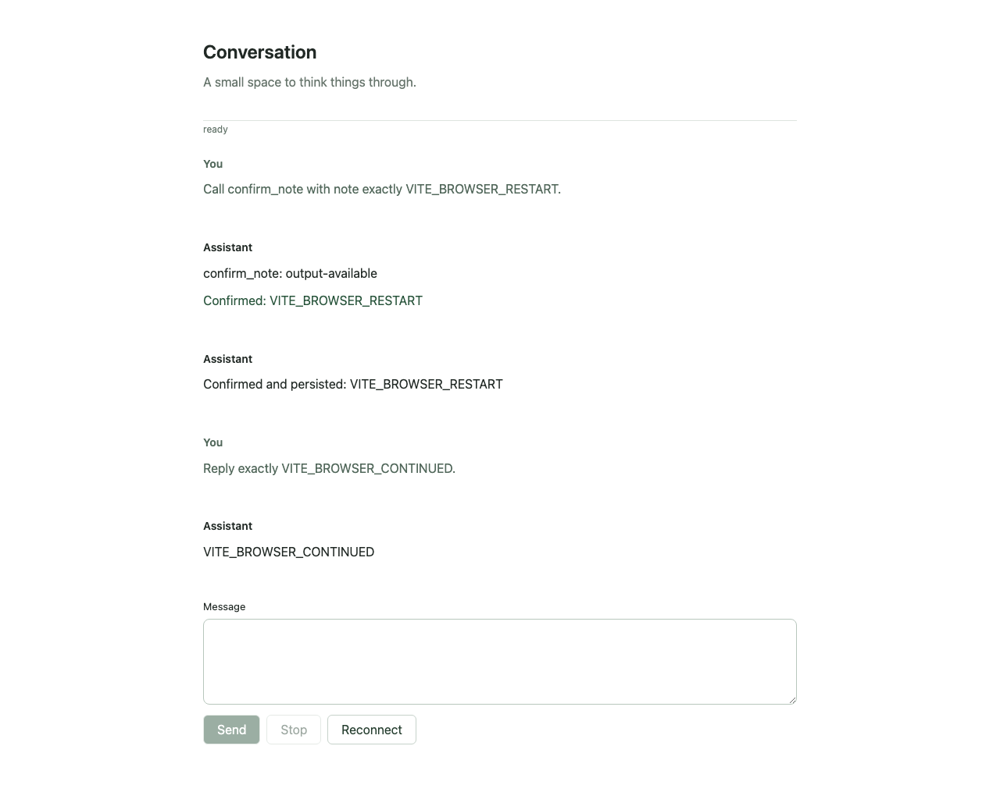
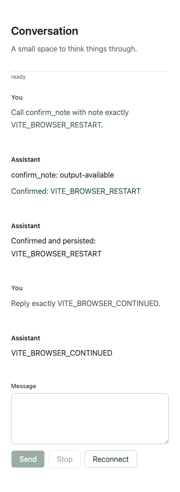

# #325 — selected linear app on Vite and Eve Node/Postgres

2026-09-06. **Bounded portability proof passed. Production/starter acceptance
remains open.** Runnable fixture: [examples/minimal-vite](../../../../examples/minimal-vite/README.md).
No deployment, publication, private Eve patch, merge of #317/#318, or upstream post.

## Pins and generation

- Base/source: PR #318 `1b47cffe692acb8e2ebaf1ebebfa7ec76df75f10`, still OPEN.
- UI PR #317: `c686b31bb0fe00e3234eaa92af7f81ed4d172ad7`, still OPEN, not integrated.
- R06 input: `3ad1ee5e`, read from its recorded fa9d fixture/report.
- Node 24.20.0, Bun 1.3.11, PostgreSQL 17.11; exact direct package versions and
  resolved dependency integrity are in the fixture manifest and Bun lockfile.
- Eve 0.52.1; Postgres World 5.0.0-beta.40; AI SDK 7.0.93;
  OpenAI 4.0.59 with real `gpt-5-mini`; React/React DOM 19.2.3;
  Vite 7.3.1; tRPC 11.16.0; TypeScript 6.0.2; Playwright 1.59.1.

Built the pinned CLI with `PATH=/opt/homebrew/opt/node@24/bin:$PATH bun run --cwd
packages/cli build`, then actually ran CLI create with the selected minimal
items plus a temporary external HTTP `portable-confirm-note` registry item.
[generate.ts](./generate.ts) reproduces this pre-adaptation generation in a new
specified directory. Original receipts are preserved under the fixture's
`provenance/`. They are historical: the adapted Vite graph is not CLI-managed.
The external registry served authored source locally; nothing was published.

## Executed results

[Sanitized observations](./evidence/results.json) and
[post-restart ACL check](./evidence/authorization-after-restart.json) contain
session IDs, counts and outcomes, but no credentials or provider response bodies.

| Gate | Result and evidence |
| --- | --- |
| Actual generated app | CLI created/typechecked selected app, including external paired backend/renderer source. |
| Vite browser boundary | 211 transformed modules; actual module audit rejects Next/app server modules. [Module graph](./evidence/browser-modules.json). Next removed from dependencies. |
| Real send/stream | OpenAI `gpt-5-mini`, 102 `message.appended` events during a fresh send; first event 1190 ms, first message append 7843 ms, completion 8998 ms. The Node adapter and Vite proxy delivered incremental events. |
| Approval/replay after restart | Final proof parked approval, stopped/restarted its Node gateway and Eve worker, and restarted its own Postgres cluster. All 94 prefix event IDs were identical; pending input recovered, typed result and continuation passed. Earlier unextended tool run also passed (18 prefix events). |
| Authorization | 28 original HTTP checks reject unauthenticated, wrong-Origin, Bob, raw routes and denied operations. Four additional checks after restart rejected Bob's forged Alice owner header for binding resolve, stream, send and cancel (404). |
| Browser | Chromium 1280×900 and 390×844; actual UI first send, pending approval, fresh browser attachment after restart, approve, `p.note` lazy renderer, follow-up send, Reconnect, exactly one tool renderer, eventual ready state. No console errors or Vite overlay. |
| External effect boundary | Separate Node HTTP receiver with separate DB. SIGKILL after durable effect insert, before response; receiver restarted. One row, two delivery attempts, same execution-derived key, completed typed tool result. Same key with changed payload returned 409. |
| Cancellation | Accepted cancellation, durable cancellation on replay, follow-up `AFTER_CANCEL_OK` passed in isolated run. Cooperative, not immediate provider abort. |
| Postgres execution | Snapshot: 42 Workflow runs, 805 Workflow events, 3790 stream chunks, 12 app bindings. Counts include setup/failure probes; they establish real Postgres use, not a count of user conversations. |
| Fixture checks | Frozen install, standalone lint/types and client build passed; 2 binding tests/11 assertions passed. |
| Repository checks | `bun lint --force` and `bun test:types --force` passed through four fresh Turbo tasks each (0 cached); normal required commands also passed. Port resolver suite: 13 tests passed. Fixture checks were fresh and are outside Turbo. |

Commands and lifecycle are in the fixture README. `scripts/proof.ts` operates on
one saved session and its prepare/resume/cancel phases must be sequential.
`stream-proof.ts` creates a separate session so it cannot cancel or mutate the
recovery proof. `effect-proof.ts` owns the only receiver processes it kills.
Browser skill was unavailable; the frontend-testing skill's Playwright fallback
used the existing available Chromium installation with a pinned local package.

## Actual Next coupling and retained contracts

The generated UI used regular React and browser-safe public Eve APIs. It did
not import Next navigation, cookies, server actions, image, or dynamic helpers.
Ten shared contract/identity/projection modules are byte-identical to the pinned
source; `results.json` records the comparisons. Project messages remain inferred
from public `EveMessageData`; note inputs/output come from the same Zod schema;
app binding remains inferred from the tRPC router. No `any` escape or model/tool
union was added at these boundaries.

The actual changes were a Vite/HTML/React root, build config, a Node HTTP adapter,
and moving two Fetch route handlers. The Eve handler's asynchronous Next `params`
becomes an explicit path argument. Trusted caller verification still happens
before durable owner-to-conversation/session lookup on every operation. The
client owns attachment/projection and draft state; the database owns binding;
Eve owns execution; the receiver owns effect dedupe. Optional saved history and
another auth product are not prerequisites.

The tool's bounded local adaptation performs an HTTP effect using public
`ctx.session.id` and `ctx.callId`, keeping its input/output contract and selected
lazy renderer unchanged. No capability/version framework or host abstraction
was introduced.

**Minimal proposed reusable seam:** expose the existing Fetch gateway/tRPC
handlers with explicit path and verified-caller inputs; supply a React entry
point and host origins. Keep the concrete Node adapter in the host recipe.
Host identity and durable authorization remain required server responsibilities.

## Corrections and evidence limits

- A machine-wide port collision occurred despite initial port discovery:
  #320 and this task both chose slot86. This task stopped only its own listeners,
  coordinated a new slot, and verified all bound process working directories.
  Final isolated listeners: Vite5877, gateway5876, Eve5875, receiver5878;
  Postgres55586 (`m29`, `m29_effects`). The initial create failed against the
  mismatched credential and produced no pass evidence. No other task's DB or
  process was changed. Stable slot configuration does not reserve ports globally.
- Initial root install hit an unrelated `fs-xattr`/cached node-gyp semver failure,
  leaving missing workspace bin links. `bun install --frozen-lockfile --ignore-scripts`
  repaired links, then forced root lint/types passed with zero cache hits. The
  standalone fixture installed frozen and passed fresh checks. No root native
  addon runtime pass is claimed.
- Screenshot review caught an overly broad text selector that could match model
  prose before the renderer loaded. It was replaced by `p.note`, and browser
  checks were rerun to eventual ready; the committed screenshots are the corrected run.
- An added streaming probe initially used the wrong Eve event name (`text.delta`;
  public Eve uses `message.appended`). An initial concurrent cancellation probe
  also interfered with that shared session. Neither attempt is a pass; the final
  stream probe owns a fresh session and cancellation was rerun independently.
- No production build was run as a substitute for types. `eve build` was needed
  for real Node/worker execution; `vite build` established the browser graph.

## Prioritized remaining portability/deployment gaps

1. **P1: supported generated host selection.** `@chatjs/minimal-next`, setup and
   installation receipts assume Next. The committed Vite fixture is a local
   adaptation; safe CLI create/add/update for Vite needs a concrete host choice
   and ownership of host files. Do not advertise a Vite starter from this proof.
2. **P1: deployment front door.** Production Vite asset serving, TLS/Secure
   identity cookies, auth-provider integration, proxy buffering/disconnects,
   readiness/drain and robust body/error policy remain unverified. Eve/Workflow
   callbacks stay private. The tested Vite proxy is a dev server.
3. **P1: Eve crash/upgrade semantics.** Pending-input clean restart passed;
   worker SIGKILL mid-provider/mid-effect, multi-replica execution and suspended
   runs across upgrades remain unproven. Receiver crash recovery does not imply
   those properties. Ambiguous conversation creation still needs reconciliation.
4. **P2: dependency/asset budget.** Browser bundle is 711.28 KB (188.92 KB gzip),
   with a separate 0.16 KB renderer chunk. Vite warns about the main chunk and
   retained `use client` directives. Eve's Node build is ~19 MB and traces native
   modules for darwin-arm64; another deployment OS needs its own build proof.
5. **P2: Eve renderer autodetection.** `eve build` detects the root Vite `index.html` as its renderer template. This proof serves UI only through Vite; the private Eve listener is not a working static Vite host. A production recipe must resolve static assets/renderer configuration explicitly.
6. **Independent gates:** #315, #313/#314 acceptance and any upstream historical
   branching support. This proof is public-Eve linear execution only.

All owned HTTP listeners and the disposable Postgres cluster were stopped after
validation. Data remains under ignored fixture directories for local replay.

No input is needed to reproduce the bounded proof beyond the documented Node,
Postgres, OpenAI credentials and free local ports. Promoting it to a supported
starter or production deployment needs separate acceptance of the above gates.

## Screenshots

